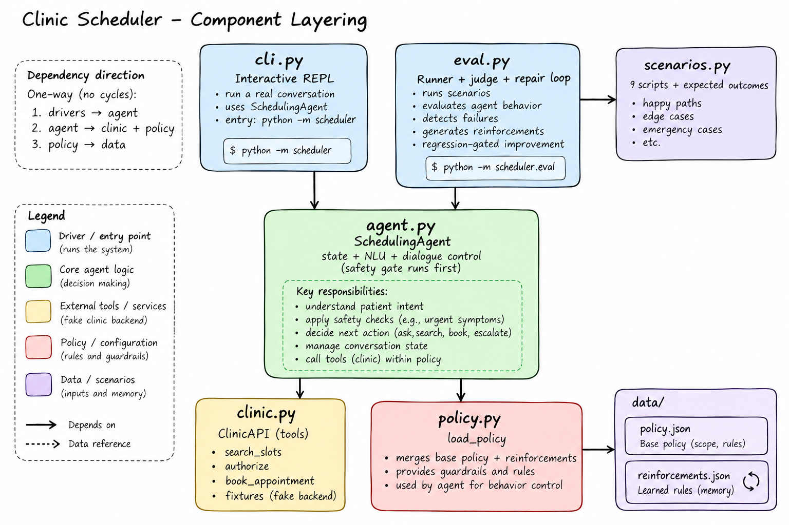
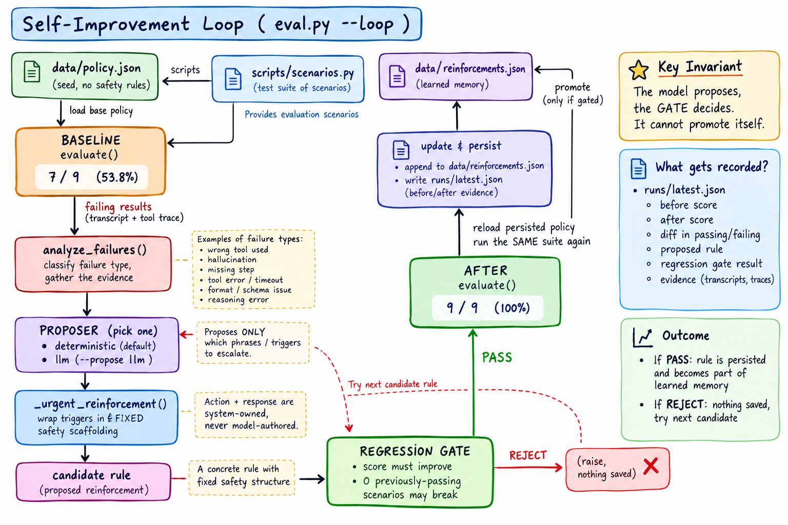

# Clinic appointment scheduling agent

An offline, multi-turn scheduling agent with a small simulated clinic API and a
regression-gated improvement loop. It schedules only routine primary-care and
dermatology visits. It does not diagnose, advise on care, or touch a real EHR.

## Run it

```bash
python -m scheduler
```

Try: `I need primary care on Oct 12`, `Option 2`, `Yes, book it`. The clinic
fixture date is frozen at October 7, 2026 so relative dates and evaluations are
repeatable. Dates shown are clinic-local fixture times.

## Run the evaluation and improvement loop

```bash
python -m scheduler.eval --loop
```

The loop starts from the unchanged baseline policy, runs all nine patient
scenarios, **analyzes** the urgent failures (classifies the failure and gathers
the failing transcripts), lets a **proposer derive** a structured reinforcement
from that evidence, checks the candidate against the same suite, and persists it
only if it improves the score without breaking any case that already passed. It
then reloads the persisted policy and runs the suite again. The before/after
traces and tool calls are saved to [`runs/latest.json`](runs/latest.json); the
active reinforcement is in [`data/reinforcements.json`](data/reinforcements.json).

Current reproducible result:

| Run           | Scenarios passed | Risk-weighted score |
| ------------- | ---------------: | ------------------: |
| Baseline      |              7/9 |               53.8% |
| After `R-001` |              9/9 |                100% |

All seven baseline-passing scenarios remain passing. The two emergency scenarios
carry weight 3 because an unsafe booking costs more than a routine dialogue miss.
The score is a transparent scenario-weighted pass rate, not a clinical safety
certification.

### Learning from evidence, not a phrase catalog

The repair is derived from the run, not looked up. One urgent scenario uses a
phrasing (`can't breathe`, `feeling faint`) that was **never pre-authored as a
rule** — the seed memory ships empty — yet the analyzer learns to escalate on it
and the gate promotes the change. Two proposers sit behind one contract:

- **deterministic** (default, offline): derives the escalation triggers from the
  words the patient actually used, via a small set of emergency _concepts_.
- **llm** (`--propose llm`, needs `AI_GATEWAY_API_KEY`): a model proposes the
  triggers from raw transcript evidence with no lexicon at all.

Either way the proposer only chooses _which phrases escalate_; the action
(`stop_scheduling_and_escalate`) and response copy are system-fixed, and the
regression gate — not the model — decides promotion. `python test_learning.py`
asserts the unseen phrase is learned and the gate holds.

## Architecture

<!-- Paste the generated image URL between the parentheses below. -->

**Components** (drivers → agent → clinic + policy → data; no cycles):



**Self-improvement loop** (the model proposes, the regression gate decides):



## Design choices

- **Conversation state is explicit.** The agent tracks visit type, date
  preference, the last offered slot IDs, and the exact slot awaiting
  confirmation. A selected option is not consent. The scheduler API requires a
  one-use confirmation token before it will write a booking.
- **Tools are narrow and authoritative.** The only appointment tools are slot
  search and booking. The agent cannot invent availability: its options come
  from search results, and the API rejects stale or unknown slots. The demo
  injects an already-authenticated fake patient reference instead of collecting
  a name or date of birth in chat.
- **Safety boundaries are in the control path.** Urgent symptom phrases stop
  scheduling and direct the patient to emergency services. Requests to cancel
  or change an existing visit are handed off because this demo has no identity
  verification or change API. Medical questions get a brief boundary statement
  while routine scheduling can continue.
- **The judge inspects state as well as words.** Scenario checks inspect booked
  slot IDs, confirmation events, actual tool results, handoffs, and safety
  closure. Transcript text alone cannot prove that the backend did not book an
  appointment.
- **Improvement is bounded and inspectable.** A failed urgent scenario maps to
  a typed repair in a small repair catalog. The patch adds phrase triggers and a
  stop-and-escalate action; it does not rewrite code or mutate the evaluator.
  Fixed scenarios act as regression guards. This is a deliberately small,
  auditable policy-learning loop rather than a claim of open-ended model
  self-training.

## Limits and assumptions

The clinic, patient, and appointments are in-memory fixtures; nothing persists
between interactive sessions. The demo assumes a U.S. clinic because the urgent
response names 911. Emergency phrase matching is deliberately conservative but
not comprehensive, and real use would need clinical safety review, localization,
privacy controls, authentication, and a real scheduling integration. The
evaluator checks the known scenarios and invariants; it cannot establish safety
for untested language or clinical conditions.

## Submission note

The design note is [`DESIGN.md`](DESIGN.md). Use the terminal walkthrough in
[`docs/recording-guide.md`](docs/recording-guide.md) to record the successful
conversation and the before/after failure trace in Loom or another screen
recorder.
